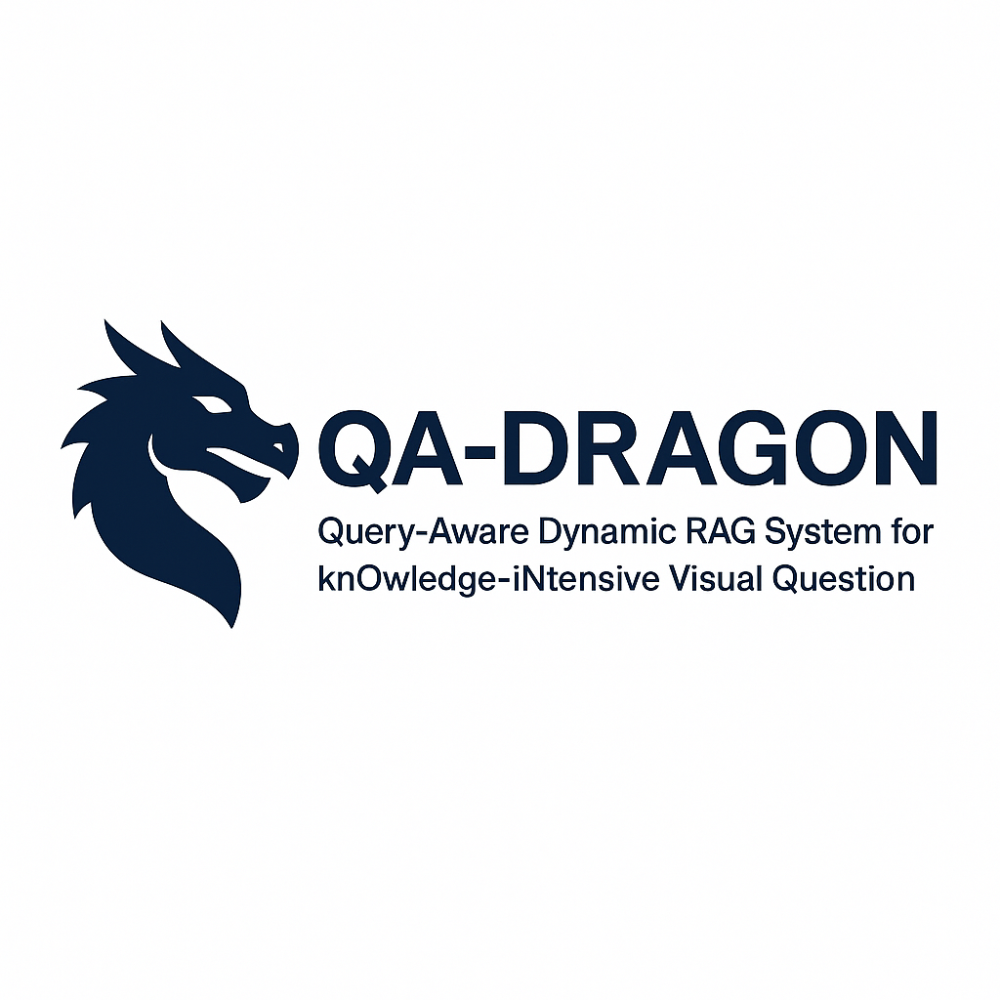
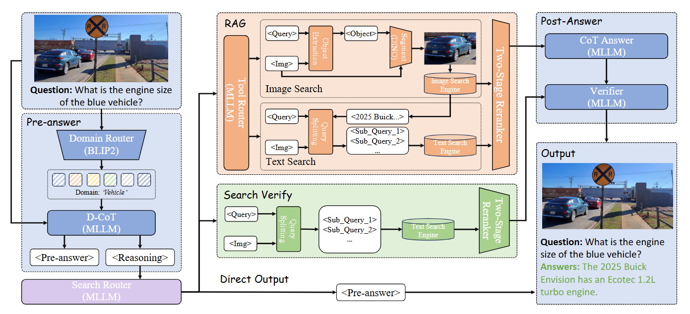
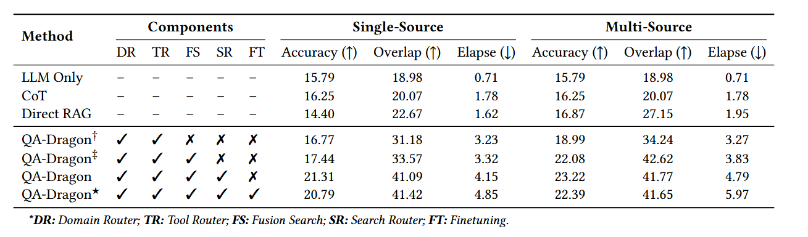

<p align="center">
  
</p>

# QA-Dragon

**QA-Dragon: Query-Aware Dynamic RAG System for Knowledge-Intensive Visual Question Answering**


## 📖 Overview

QA-Dragon is a sophisticated Visual Question Answering (VQA) system that leverages dynamic Retrieval-Augmented Generation (RAG) to provide accurate and contextually relevant answers to knowledge-intensive visual questions. The system combines advanced vision-language models with intelligent routing mechanisms to handle complex queries across multiple domains.

## 🏗️ System Architecture

<p align="center">
  
</p>

### Core Components

#### 1. **Query Processing & Routing**
- **Domain Router**: Automatically detects query domains using BLIP2-based classification
- **Complexity Router**: Assesses query complexity to determine processing strategy
- **Answerable Router**: Determines if queries can be answered directly or require external knowledge
- **Tool Router**: Decides whether to use image search, text search, or both

#### 2. **Multi-Modal Search Pipeline**
- **Image Search**: Leverages object detection and visual similarity for image-based retrieval
- **Text Search**: Generates optimized search queries for web-based knowledge retrieval
- **Hybrid Search**: Combines both modalities for comprehensive information gathering

#### 3. **RAG Context Building**
- **Context Builder**: Aggregates and structures retrieved information
- **Answer Generator**: Generates responses using retrieved context
- **Verifier**: Validates answer accuracy and reliability

#### 4. **Specialized Agents**
- **Reasoning Agent**: Handles complex reasoning tasks with domain awareness
- **Direct Answer Agent**: Provides immediate responses for simple queries
- **CoT Agent**: Implements Chain-of-Thought reasoning for complex problems

## 🚀 Key Features

### 🔍 **Dynamic Query Routing**
- Intelligent routing based on query characteristics
- Domain-aware processing for specialized knowledge areas
- Complexity-based strategy selection

### 🖼️ **Multi-Modal Retrieval**
- Image-based object detection and similarity search
- Text-based knowledge retrieval with query optimization
- Hybrid search combining visual and textual information

### 🧠 **Advanced Reasoning**
- Chain-of-Thought reasoning for complex queries
- Domain-specific knowledge integration
- Uncertainty quantification and confidence scoring

### ✅ **Quality Assurance**
- Answer verification and validation
- Blacklist filtering for inappropriate content
- Multi-stage quality checks

## 📁 Project Structure

```
QA-Dragon/
├── agents/
│   ├── base.py                 # Base agent interface
│   ├── qa_dragon.py           # Main QA-Dragon implementation
│   ├── modules/               # Core processing modules
│   │   ├── routers/           # Query routing components
│   │   ├── answer.py          # Answer generation agents
│   │   ├── filter.py          # Content filtering
│   │   └── text_search_generator.py
│   ├── tools/                 # Utility tools
│   │   ├── rag/              # RAG components
│   │   ├── search/           # Search functionality
│   │   ├── pre_processing/   # Input preprocessing
│   │   └── post_processing/  # Output postprocessing
│   ├── lavis/                # BLIP2 model integration
│   └── utils/                # Utility functions
├── Images/                   # System diagrams and logos
└── README.md                # This file
```

## 🛠️ Installation & Setup

### Prerequisites
- Python 3.8+
- CUDA-compatible GPU (recommended)
- PyTorch 2.0+
- Transformers library

### Installation Steps

1. **Clone the repository**
```bash
git clone https://github.com/your-username/QA-Dragon.git
cd QA-Dragon
```

2. **Install dependencies**
```bash
pip install -r requirements.txt
```

3. **Setup configuration**
```bash
# Copy and modify the configuration file
cp configs/qadragon.yaml.example configs/qadragon.yaml
```

## 🎯 Usage

### Basic Usage

```python
from agents.qa_dragon import QADragon4Multi
from PIL import Image

# Initialize the agent
agent = QADragon4Multi(
    domain_aware=True,
    all_text_verify=True,
    enable_saver=False
)

# Prepare inputs
query = "What is the capital of France?"
image = Image.open("paris_image.jpg")

# Generate response
response = agent.batch_generate_response(
    queries=[query],
    images=[image],
    message_histories=[[]]
)

print(response[0])
```

### Advanced Configuration

```python
# Initialize with custom settings
agent = QADragon4Multi(
    domain_aware=True,          # Enable domain detection
    all_text_verify=True,       # Enable text verification
    enable_saver=True,          # Enable result saving
    use_black_list=True,        # Enable content filtering
    logging_level="INFO"        # Set logging level
)
```

## 🔧 Configuration

The system uses YAML configuration files for easy customization:

```yaml
basic:
  model_name: "your-llm-model"
  max_img_size: 1024
  VLLM_TENSOR_PARALLEL_SIZE: 1
  VLLM_GPU_MEMORY_UTILIZATION: 0.9

rag:
  context_builder:
    max_context_length: 4000
  generation:
    max_new_tokens: 512
    temperature: 0.7

postprocessing:
  verifier:
    enabled: true
    confidence_threshold: 0.8
```

## 📊 Performance

QA-Dragon demonstrates superior performance on knowledge-intensive VQA tasks:

<p align="center">
  
</p>

### Key Metrics
- **Accuracy**: Significantly outperforms baseline models
- **Response Time**: Optimized for real-time applications
- **Domain Coverage**: Handles diverse knowledge domains
- **Robustness**: Reliable performance across query types

## 🔬 Research & Development

### Supported Models
- **Vision Models**: BLIP2, CLIP, EVA-ViT
- **Language Models**: Various LLM backends via VLLM
- **Rerankers**: BLIP2-based image-text matching

### Extensibility
The modular architecture allows easy integration of:
- New vision-language models
- Custom routing strategies
- Domain-specific knowledge bases
- Alternative search engines

## 🤝 Contributing

We welcome contributions! Please see our [Contributing Guidelines](CONTRIBUTING.md) for details.

### Development Setup
```bash
# Install development dependencies
pip install -r requirements-dev.txt

# Run tests
python -m pytest tests/

# Format code
black agents/
isort agents/
```

## 📄 License

This project is licensed under the MIT License - see the [LICENSE](LICENSE) file for details.

## 🙏 Acknowledgments

- BLIP2 team for the vision-language model
- VLLM team for efficient LLM serving
- The open-source community for various tools and libraries

## 📞 Contact

For questions, issues, or contributions:
- **Issues**: [GitHub Issues](https://github.com/your-username/QA-Dragon/issues)
- **Discussions**: [GitHub Discussions](https://github.com/your-username/QA-Dragon/discussions)
- **Email**: your-email@example.com

---

<p align="center">
  <em>Built with ❤️ for advancing Visual Question Answering research</em>
</p>
